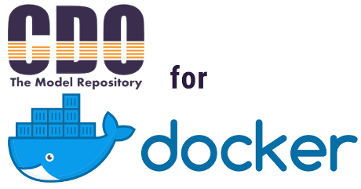

<p>
 
</p>


# CDO Server as Docker Container (CDOSaaDC)

This repository contains [Eclipse CDO](https://www.eclipse.org/cdo/) and all necessary configuration files to build and run the server in a Docker container.

> **A note concerning the version of this CDO Model Repository:** Oxygen is the target of this build, Eclipse 4.7 + EMF 2.13

## Requirements

| Name           | Version    |
| -------------- | ---------- |
| Docker         | >= 19.03.8 |
| Docker-Compose | >= 1.25.4  |


### Install Docker and Docker-Compose

```bash
# Install docker: https://docs.docker.com/install/

# Install docker-compose: https://docs.docker.com/compose/install/
$ sudo curl -L "https://github.com/docker/compose/releases/download/1.25.4/docker-compose-$(uname -s)-$(uname -m)" -o /usr/local/bin/docker-compose
```


## Build Configuration

First, clone this repository and make sure that you have enough space on your filesystem. Then change into the repository folder.

Use the following scripts in this order to setup the CDO server and build the Docker image:

```bash
# It may be necessary to run 'chmod +x' first on these scripts
$ configure.sh
$ build.sh
```

The `build.sh` script is essentially doing the following:

```bash
# Build the image
$ docker-compose build
```

Then **start the container** by typing:

```bash
$ docker-compose up
```

If everything runs fine the output should look like this:

```bash
...
Creating cdo-server-oxygen-docker_cdo-server_1 ... done
Attaching to cdo-server-oxygen-docker_cdo-server_1
cdo-server_1  | [INFO] CDO server starting
cdo-server_1  | [INFO] CDO repository repo1 started
cdo-server_1  | [INFO] Repository configuration manager extension starting
cdo-server_1  | [INFO] Repository configuration manager extension started
cdo-server_1  | [INFO] Net4j extension starting
cdo-server_1  | [INFO] Net4j acceptor starting: tcp://0.0.0.0:2036
cdo-server_1  | [INFO] Net4j extension started
cdo-server_1  | [INFO] Security extension starting
cdo-server_1  | [INFO] Security extension started
cdo-server_1  | [INFO] CDO server started
...
```


The CDO server is now available under `localhost:2036`. 

The default name of the CDO repository is `repo1`.

A *volume* is created for the folders `./aux/database` and `./aux/configuration` in order to persist the database changes when the user updates the database (otherwise the database is useless and looses all changes when the container is stopped).

You can also use the standard `docker-compose` commands to build and run the image:

```bash
# Build the image and run the container
$ docker-compose up --build
```


## Repository Configuration

- How to change the repository name?
  - Make the necessary changes in `cdo-server.xml`
- How to change the port of the CDO server?
  - Make the necessary changes in `cdo-server.xml`, `docker-compose.yaml` and `Dockerfile`
- How to use another database from the host system than the one provided?
  - Make the necessary changes in `cdo-server.xml`, `docker-compose.yaml` and `Dockerfile`

## Further Resources

- https://gitlab2.informatik.uni-wuerzburg.de/descartes/tools.descartes.dml.cdo.server.docker
- https://github.com/robertblust/cdo-server
- https://www.eclipse.org/forums/index.php/t/1066804/